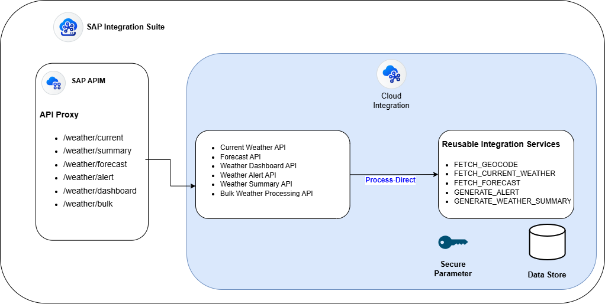

# ☀️ sap-gcp-weather-suite ☔
### Built using SAP Integration Suite, SAP API Management, Google Cloud Platform & Gemini AI

---

## Overview
A simplified weather integration solution built on the **SAP Integration Suite (CPI &amp; APIM)** that unifies **GCP Geocode, Weather and Gemini APIs** services into standardized REST enpoints.
A secure and scalable integration layer with API orchestration, modular intergration architecture, featuring capabilities like **caching, authentication, error handling, monitoring and built-in failover capabilities.**

---

## 📁 Repository Structure

```text
sap-gcp-weather-suite/
├── apim/                                # SAP API Management configuration & policies
│   ├── api-specs/                       # OpenAPI 3.0 specifications (Weather API)
│   ├── policies/                        # API Gateway policies (Rate limiting, OAuth 2.0, Caching)
|   |── README.md/                       # APIM documentation
│   └── .gitignore/                      # apim Git ignore rules
├── assets/                              # Shared assets and diagrams
├── iflows/                              # SAP Cloud Integration Flows (iFlows)
├── script-collection/                   # Reusable script collections
├── APIs.postman_collection.json/        # Postman Collection
└── README.md                            # Root repository documentation
```
---

## Business Problem
Many organizations and developers rely on weather information for critical business processes such as:
- Logistics & Supply Chain
- Aviation & Transportation
- Delivery or surge charge calculations
- Application UI updates

Direct integration with external weather providers presents several challenges:

- Vendor-specific response formats
- Multiple API integrations
- No centralized security
- No API governance
- Lack of caching

This project solves these challenges using SAP Integration Suite as the integration layer and SAP API Management as the enterprise API gateway.

---

## Solution Architecture


### API Catalog

| API | Method | Description |
|-----|--------|-------------|
| /weather/current | GET | Retrieve current weather |
| /weather/forecast | GET | Retrieve weather forecast |
| /weather/dashboard | GET | Aggregate current weather, forecast, summary and alerts |
| /weather/summary | GET | AI-generated readable weather summary |
| /weather/alerts | GET | Retrieve weather alerts |
| /weather/bulk | POST | Bulk weather processing |

### Internal Reusable Services


The solution follows a modular architecture where primary IFlows with sender HTTP endpoint reuses internal flows via ProcessDirect adapter.

| ProcessDirect Service | Responsibility |
|-----------------------|---------------|
| FETCH_GEOCODE | Convert address into coordinates and vice-verse |
| FETCH_CURRENT_WEATHER | Retrieve current weather |
| FETCH_FORECAST | Retrieve weather forecast |
| GENERATE_ALERTS | Generate weather alerts |
| GENERATE_WEATHER_SUMMARY | Generate AI-powered weather summary |

This design minimizes duplication and enables multiple APIs to reuse the same integration components.

### Caching Strategy

The solution implements a two-layer caching strategy.
Layer 1: 
SAP API Management Response Cache Policy
Purpose:- Reduce repeated client requests

Layer 2
SAP CPI Data Store
Purpose:- 
- Reduce external API calls
- Improve response time
- Minimize Google API usage and cost optimization
- Failover Resiliency

### Exception Handling

The platform handles different failure scenarios gracefully.

Examples include:

- Invalid address or coordinates
- Geocoding failure
- Weather API timeout or downtime
- Partial failures during bulk processing

Bulk APIs return partial-success responses whenever possible instead of failing the complete request.

---

## 🚀 Getting Started

### Prerequisites
* SAP Integration Suite tenant (with Cloud Integration and API Management enabled).
* Google Cloud Platform (GCP) account with Geocoding, Weather, and Gemini API keys.

### Deployment Steps
1. **CPI Setup**: Import the integration packages from the `/iflows` directory into your SAP Cloud Integration tenant. Configure your GCP API keys in the CPI secure parameters.
2. **APIM Setup**: Import the API proxies and policy templates from the `/apim` directory into SAP API Management.
3. **Testing**: Import the `SAP-GCP Weather APIs.postman_collection.json` file into Postman, update your environment variables (Host, API keys), and start testing the endpoints!

---

## Project Status

Current Implementation

- Current Weather API
- Weather Forecast API
- Weather Dashboard API
- Weather Alerts API
- AI Weather Summary API
- Bulk Weather Processing API
- ProcessDirect reusable architecture
- Layered caching
- Exception handling
- SAP API Management policies

---

## Future Enhancements

- Scheduled weather notifications
- Redis caching
- SAP HANA persistence
- CI/CD using GitHub Actions

---

## Author

**Monish Soni**

SAP Cloud Integration Developer

SAP Integration Suite | SAP API Management | Google Cloud Platform | Enterprise Integration | REST APIs | Groovy | GenAI
