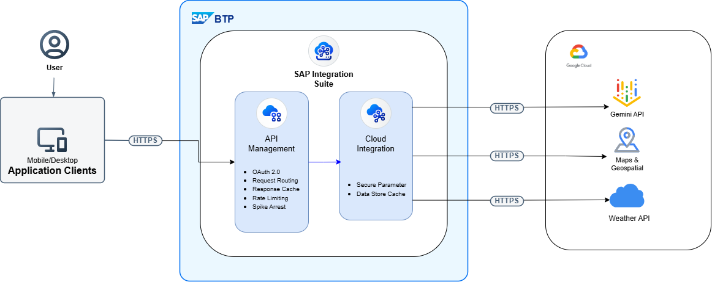

<<<<<<< HEAD
# API Management Configuration

This repository contains comprehensive API Management policies and specifications for the Weather Forecast API integration.

## 📁 Directory Structure

```
apim/
├── api-specs/                           # OpenAPI specifications
│   └── RequestWeatherForecast.yaml
├── policies/                            # API Management policies (11 total)
│   ├── authorization.xml                # Basic authentication encoding
│   ├── cacheaccesstoken.xml             # OAuth token caching
│   ├── getcredential.xml                # Credential extraction
│   ├── getoauthtoken.xml                # OAuth 2.0 token request
│   ├── Key_Value_Ops.xml                # Secure credential retrieval
│   ├── quota.xml                        # Request quota limiting
│   ├── raisetokenerror.xml              # OAuth error handling
│   ├── readaccesstoken.xml              # Token extraction from response
│   ├── readcachedtoken.xml              # Cached token lookup
│   ├── response-cache.xml               # API response caching
│   ├── spike-arrest.xml                 # Traffic throttling
│   └── README.md                        # Policy documentation
├── README.md                            # This file
└── .gitignore                           # Git ignore rules
```

## 🎯 Overview

### API Specifications
- **Weather Forecast API** (`api-specs/RequestWeatherForecast.yaml`)
  - OpenAPI 3.0.1 specification with 6 endpoints
  - Supports location-based and coordinate-based queries
  - Includes current weather, forecasts, alerts, and bulk processing

### Policies (11 Total)

**Rate Limiting & Throttling:**
- `spike-arrest.xml` - Throttles requests (30 req/min)
- `quota.xml` - Calendar-based quota enforcement (60 req/min)

**Security & Authentication:**
- `authorization.xml` - Basic authentication credential encoding
- `getcredential.xml` - Credential extraction and assignment
- `Key_Value_Ops.xml` - Secure credential store retrieval

**OAuth 2.0 Token Management:**
- `getoauthtoken.xml` - Request OAuth 2.0 access tokens (client credentials flow)
- `readaccesstoken.xml` - Extract token from OAuth response
- `readcachedtoken.xml` - Retrieve cached tokens for reuse
- `cacheaccesstoken.xml` - Cache tokens with 1-hour TTL
- `raisetokenerror.xml` - Handle and return OAuth errors

**Performance & Caching:**
- `response-cache.xml` - Cache API responses (1-hour TTL)

See `policies/README.md` for detailed policy documentation and OAuth flow sequence.

## 🚀 Quick Start

1. Review the API specification:
   ```
   api-specs/RequestWeatherForecast.yaml
   ```

2. Configure policies:
   ```
   policies/
   ```

3. Deploy to your API Management gateway

## 📋 API Endpoints

- **GET `/current`** - Current weather forecast
- **GET `/summary`** - Weather forecast summary
- **GET `/forecast`** - Daily or hourly forecast
- **GET `/alert`** - Weather alerts
- **GET `/dashboard`** - All forecast information
- **POST `/bulk`** - Bulk forecast processing for multiple locations

## ⚙️ Configuration

All policies support environment-specific configuration:
- **OAuth Endpoint**: Update URL in `getoauthtoken.xml`
- **Rate Limits**: Adjust limits in `spike-arrest.xml` and `quota.xml`
- **Cache TTL**: Modify timeout values in `response-cache.xml` and `cacheaccesstoken.xml`
- **Credentials**: Update references in `Key_Value_Ops.xml` and `getcredential.xml`
- **Header Names**: Update custom header references as needed

Refer to `policies/README.md` for detailed configuration guidance for each policy.

## 📝 License

Add your license information here.

## 🤝 Contributing

Add contribution guidelines here.

## 📞 Support

For questions or issues, please refer to the policy documentation in `policies/README.md`.
=======
# ☀️ sap-gcp-weather-suite ☔
### Built using SAP Integration Suite, SAP API Management, Google Cloud Platform & Gemini AI

---

## Overview
A simplified weather intgration solution built on the **SAP Integration Suite (CPI &amp; APIM)** that unifies **GCP Geocode, Weather and Gemini APIs** services into standardize REST enpoints.
A secure and scalable integration layer with API orchestration, modular intergration architecture, featuring capablities like **caching, authentication, error handling, monitoring and built-in failover capabilities.**

---

## Business Problem
Many organizations and developers rely on weather information for critical business processes such as:
- Logistics & Supply Chain
- Aviation & Transportation
- Delivery or surge charge calculations
- Application UI updates

Direct integration with external weather providers presents several challenges:

- Vendor-specific response formats
- Multiple API integrations
- No centralized security
- No API governance
- Lack of caching

This project solves these challenges using SAP Integration Suite as the integration layer and SAP API Management as the enterprise API gateway.

---

## Solution Architecture


### API Catalog

| API | Method | Description |
|-----|--------|-------------|
| /weather/current | GET | Retrieve current weather |
| /weather/forecast | GET | Retrieve weather forecast |
| /weather/dashboard | GET | Aggregate current weather, forecast, summary and alerts |
| /weather/summary | GET | AI-generated readable weathe summary |
| /weather/alerts | GET | Retrieve weather alerts |
| /weather/bulk | POST | Bulk weather processing |

### Internal Reusable Services


The solution follows a modular architecture where primary IFlows with sender HTTP endpoint reuses internal flows via ProcessDirect adapter.

| ProcessDirect Service | Responsibility |
|-----------------------|---------------|
| FETCH_GEOCODE | Convert address into coordinates and vice-verse |
| FETCH_CURRENT_WEATHER | Retrieve current weather |
| FETCH_FORECAST | Retrieve weather forecast |
| GENERATE_ALERTS | Generate weather alerts |
| GENERATE_WEATHER_SUMMARY | Generate AI-powered weather summary |

This design minimizes duplication and enables multiple APIs to reuse the same integration components.

### Caching Strategy

The solution implements a two-layer caching strategy.

Layer 1

SAP API Management Response Cache Policy

Purpose:

- Reduce repeated client requests

Layer 2

SAP CPI Data Store

Purpose:

- Reduce external API calls
- Improve response time
- Minimize Google API usage and cost optimization
- Failover Resiliency

### Exception Handling

The platform handles different failure scenarios gracefully.

Examples include:

- Invalid address or coordinates
- Geocoding failure
- Weather API timeout or downtime
- Partial failures during bulk processing

Bulk APIs return partial-success responses whenever possible instead of failing the complete request.

---

## Project Status

Current Implementation

- Current Weather API
- Weather Forecast API
- Weather Dashboard API
- Weather Alerts API
- AI Weather Summary API
- Bulk Weather Processing API
- ProcessDirect reusable architecture
- Layered caching
- Exception handling
- SAP API Management policies

---

## Future Enhancements

- Scheduled weather notifications
- Redis caching
- SAP HANA persistence
- CI/CD using GitHub Actions

---

## Author

**Monish Soni**

SAP Cloud Integration Developer

SAP Integration Suite | SAP API Management | Google Cloud Platform | Enterprise Integration | REST APIs | Groovy | GenAI
>>>>>>> 90cd646f8b00e4da2976e1f1702cf8e5c2b35241
